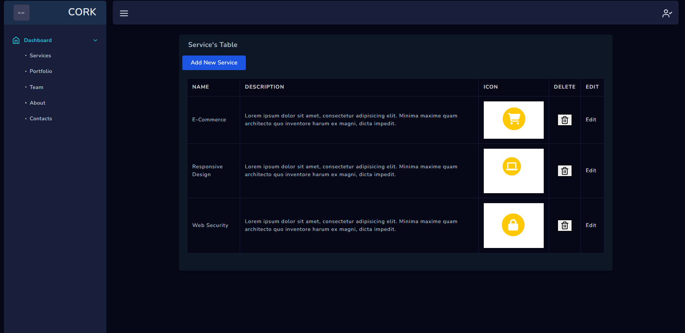

## About Project
Laravel application for company portfolio with admin dashboard.

## Features

- The project is based on Repository pattern. 
- All inputs have backend validations by using Custom validation Requests.
- Customizing successfull and error results by using SweetAlert Package.
- Well organized Routes.

## 1-Front End 

- Services Page 

- Portfolio Page

- About Page

- Team Page

- Contact Form

## Dashboeard

- Login page

- All services

- Add service

- Edit service

- service validations

- Messages from people

## 🔗 Feedback
If you have any feedback, please reach out to me :-

